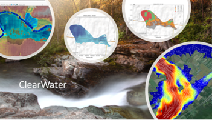
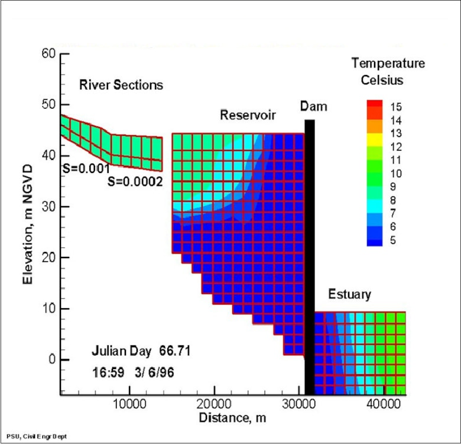

# Water Quality Modeling - Frequently Asked Questions

## ClearWater (Corps Library for Environmental Analysis and Restoration fo Watersheds)

The Environmental Laboratory of the Engineer Research and Development Center (ERDC-EL), U.S. Army Corps of Engineers (USACE), is developing new water quality simulation and analysis capabilities that leverage existing river, reservoir, and watershed runoff models developed using hydraulic and hydrologic (H&H) simulation programs that are widely used by USACE, other federal, state, and local agencies, universities, non-profit organizations, and consulting firms. These programs include HEC-RAS, HEC-ResSim, HEC-HMS, and GSSHA. This work is being performed in collaboration with the USACE Hydrologic Engineering Center (HEC) and the ERDC Coastal and Hydraulic Laboratory. The water quality and vegetation modeling capabilities have been developed as a modular library of environmental modeling capabilities, the Corps Library for Environmental Analysis and Restoration of Watersheds (ClearWater). ClearWater is being linked with the H&H models to support Ecosystem Restoration, which is one of the primary missions of USACE.

ClearWater consists of several components that are designed to leverage existing hydrologic and hydraulic (H&H) models:

* Water quality kinetics and vegetation simulation modules
    * NSM: Nutrient Simulation Module (NSM-I and NSM-II)
    * TSM: Temperature Simulation Module
    * GSM: General Constituent Simulation Module
    * CSM: Contaminant Simulation Module
    * MSM: Mercury Simulation Module
    * SSM: Solids Simulation Module
    * RVSM: Riparian Vegetation Simulation Module
* A water quality engine that computes the transport (advection and diffusion) of heat and mass across the watershed
* Data visualization and reporting capabilities
* A water quality framework that integrates the water quality modules, water quality engine, existing H&H models, initial and boundary condition data, output data, and a user interface (Jupyter notebook) to form a comprehensive, integrated, adaptable, and customizable environmental modeling and analysis system.
Currently, ClearWater is focused on two-dimensional modeling capabilities that leverage HEC-RAS-2D and GSSHA models, which provide the model geometry (grid) and flows to the ClearWater system.

## CE-QUAL-W2 Water Quality Model

CE‐QUAL‐W2 (W2) is a two‐dimensional (2D), longitudinal/vertical, hydrodynamics and water quality model. Because the model assumes lateral homogeneity, it is especially suited for relatively long and narrow waterbodies exhibiting longitudinal and vertical water quality gradients. The model has been applied to rivers, lakes, reservoirs, estuaries, and combinations thereof.

CE‐QUAL‐W2 (W2) is a two‐dimensional (2D), longitudinal/vertical, hydrodynamics and water quality model. Because the model assumes lateral homogeneity, it is especially suited for relatively long and narrow waterbodies exhibiting longitudinal and vertical water quality gradients. The model has been applied to rivers, lakes, reservoirs, estuaries, and combinations thereof.  

|  |
|--|
| Longitudinal view of temperature output for a riverine section, reservoir, and estuary, from a CE‐QUAL‐W2 model application. |

More information can be found here: https://github.com/EnvironmentalSystems/CE-QUAL-W2/edit/main/README.md

## HEC-RAS Water Quality Model

* **Which version of HEC-RAS should I use for water quality modeling?** HEC-RAS Version 5.0.7 contains the latest features and bug fixes. We are also working on a new release of water quality capabilities in Version 6.0. 
    * https://github.com/HydrologicEngineeringCenter/hec-downloads/releases/download/1.0.7/HEC-RAS_507_Without_Examples_Setup.exe
* **Can steady-flow water quality be simulated using HEC-RAS?** Water quality simulations in HEC-RAS require first running the unsteady flow simulation, not the steady flow simulation. To simulate "steady flow" conditions, you would need to input a constant-flow time series into the model, but this would still be considered an "unsteady" flow.
* **What background do I need for water quality modeling?** Water quality modeling requires a significant background in hydrology, hydraulics, water quality, and various other fields. If you haven't already taken one or two courses in water quality modeling, we recommend seeking out training and additional references to supplement your work. We have provided a list of recommended references below.
* **Can HEC-RAS simulate stratified conditions in reservoirs?** No. HEC-RAS is capable of simulating 1D (longitudinally varying) water quality in unstratified river channels. If you need to simulate stratified conditions, we recommend CE-QUAL-W2 (2D reservoir hydrodynamics and water quality model) or HEC-ResSim (1D reservoir operations model).

## HEC-ResSim Water Quality Model

## HEC-HMS Water Quality Model

## GSSHA Water Quality Model

## Water Quality Modeling References

* Chapra, Steven C., 1997. *Surface Water Quality Modeling*
* Thomann, Robert V. and John A. Mueller, 1987. *Principles of Surface Water Quality Modeling and Control*
* Martin, James L. and Steven C. McCutcheon, 1998. *Hydrodynamics and Transport for Water Quality Modeling*
